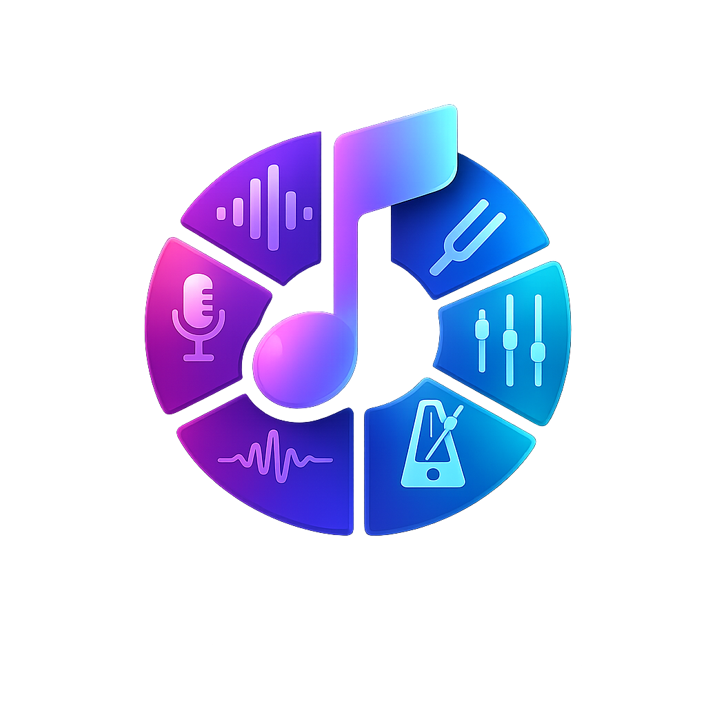

<p align="center">
  
</p>

# Musician Toolkit

**v0.2.0** — A complete browser-based toolkit for guitarists, songwriters, and bands. No installation, no account, no server — everything runs locally in your browser with `localStorage` for persistence.

---

## Tabs

| Tab | Description |
|-----|-------------|
| 🎸 Tuner | Chromatic tuner via microphone — cents meter, per-string reference panel |
| 🥁 Metronome | Tap tempo, time signatures 2/4–7/8, BPM 40–240 |
| 🎵 Chords | SVG chord diagrams with multiple voicings, search any chord |
| 🎼 Scales | Interactive fretboard for 12 scale types, click to hear notes |
| ⭕ Circle of Fifths | Interactive major/minor rings, diatonic chord display, jump-to-chord |
| 📓 Song Vault | CRUD song cards with key, BPM, lyrics/chord notes, MusicBrainz lookup |
| 📋 Setlist Builder | Drag-and-drop setlists with runtime stats and print export |
| 🔧 Tools | Chord transposer, capo calculator, rhyme finder |
| 👂 Ear Training | Play random intervals or chords via Web Audio — guess and score |
| ⚡ Speed Trainer | Auto-ramping metronome: start slow, increase BPM every N seconds |
| 💸 Expense Splitter | Track shared band costs; calculates who owes who |
| 📞 Band Contacts | Names, roles, phones, emergency contacts for every member |
| ⚙️ Settings | GitHub backup/restore |

---

## Opening the App

Open `index.html` directly in a modern browser. No build step, no dependencies, no server required.

**Chrome/Edge:** The microphone (Tuner tab) requires a secure context. A plain `file:///` URL may be blocked. Serve locally instead:

```bash
# Node
npx serve .

# Python
python3 -m http.server 8080
```

Then open `http://localhost:8080`.

**Firefox / Safari:** Microphone works from `file:///` by default.

---

## MusicBrainz Lookup

Used to auto-fill artist, duration, and genre when adding songs to the Song Vault.

**No API key or account needed.** MusicBrainz is a free, open music metadata database.

When editing a song in the Song Vault, press **🔍 Lookup on MusicBrainz** to search by title (and artist). Pick a result to auto-fill the artist, duration, and genre. Lyrics are fetched from lyrics.ovh in parallel.

Rate limit: 1 request/second.

---

## GitHub Backup (optional)

Backs up all songs and setlists to a GitHub repository as a single JSON file.

1. Create a repository on GitHub (public or private).
2. Generate a **Personal Access Token (PAT)** with `repo` scope at [github.com/settings/tokens](https://github.com/settings/tokens).
3. In ⚙️ Settings → GitHub Backup, fill in:
   - **Owner** — your GitHub username
   - **Repository** — the repo name
   - **Token** — your PAT
   - **File path** — where to save (default: `musician-toolkit/data.json`)
4. Click **Save Settings**, then **Push** to back up.

To restore on another device: enter the same settings and click **Pull**.

> The token is transmitted only to `api.github.com` via an `Authorization: Bearer` header. It is never written to console logs, URLs, or any third-party service.

---

## Microphone Permissions (Tuner)

- Microphone is only requested when you press **START TUNER**.
- The audio stream is closed automatically when you stop the tuner or switch tabs.
- No audio is stored or transmitted anywhere.

---

## Tools

### Transposer
Paste any chord chart (plain text, with or without lyrics). Use the **−1 / +1** buttons to shift up or down by semitones, or **−6 / +6** to jump a tritone. Press **↕ Swap** to use the transposed output as the new input. Press **Copy** to copy the result.

### Capo Calculator
Select your target key. The table shows which open-chord shapes to play at each capo position (0–7). Positions marked ★ use common open shapes (C, D, E, G, A).

### Rhyme Finder
Enter a word and press **Find Rhymes** or Enter. Results are fetched from the [Datamuse API](https://www.datamuse.com/api/) (free, no API key needed). Click any word chip to copy it to the clipboard.

---

## Ear Training

Choose **Intervals** or **Chords** mode. Press ♪ to hear the audio, then pick from four options. Your correct/total score is tracked for the session.

## Speed Trainer

Set a start BPM, target BPM, step size, and interval in seconds. The click track starts at the start BPM and automatically increases by the step every N seconds until the target is reached.

## Expense Splitter

Log shared costs (rehearsal space, gear, van fuel) with who paid and who participates. The settlement panel shows the minimum payments needed to clear all balances. Data persists in localStorage.

## Band Contacts

Store name, role, phone, email, and emergency contact for every band member. Cards are editable and deletable. Data persists in localStorage.

---

## Browser Support

Chrome 90+, Firefox 88+, Edge 90+, Safari 15+. Requires Web Audio API support.

## Data Storage

All data lives in `localStorage` under the `musician_*` namespace. Nothing is sent to any server unless you explicitly use GitHub sync.
